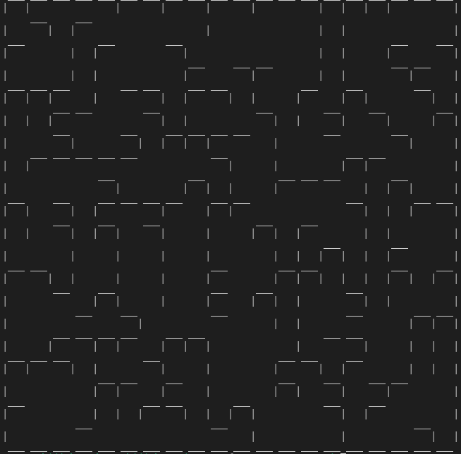

# Perfect-Maze-Generator

A Perfect maze is a maze whose every path is connected to every other path, so there won't be any unreachable areas. 
And there won't be any path loops or isolated walls.

PerfectMazeGenerator generates a random perfect maze each time it is executed. 

 

## Requirements

Use the package manager [pip](https://pip.pypa.io/en/stable/) to install the following.

```bash
pip install Pillow
pip install numpy
```

## Usage

```python
python PerfectMazeGenerator.py --width width --height height 
