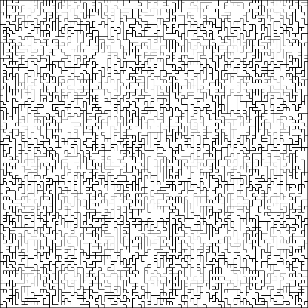
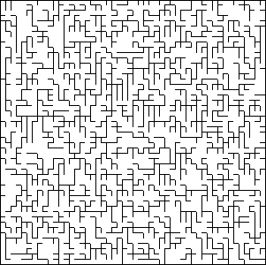
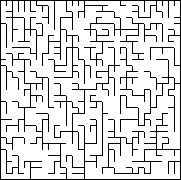

# Perfect-Maze-Generator

A Perfect maze is a maze whose every path is connected to every other path, so there won't be any unreachable areas. 
A perfect maze won't have any path loops or isolated walls.

PerfectMazeGenerator make use of Eller's algorithm to generate a random perfect maze each time it is executed. Eller's Algorithm is one of the most memory efficient algorithm. It create mazes row by row so it only requires the current row to be stored in memory.  The algorithm itself is incredibly fast, and far more memory efficient than other popular algorithms (such as Prim's and Kruskal's). This makes it possible to create mazes of indefinite length on systems with limited memory.

`Maze.png` is a perfect maze with a dimension of 1000 * 1000 generated by the program.

## Demo 

 

   


## Requirements

Use the package manager [pip](https://pip.pypa.io/en/stable/) to install the following.

```bash
pip install Pillow
pip install numpy
```

## Usage

```python
python PerfectMazeGenerator.py --width width --height height 

